# 🌐 Sistema de Gestión y Acreditación del Congreso Nacional de Ciencias de la Computación (CCBOL2024)

## 👤 Autor
**[Marcani Israel]**  
_Rol en el proyecto_: Desarrollador Full stack y organizador del equipo.

---

## 📝 Descripción del Proyecto
El proyecto consistió en el desarrollo de una página web integral para la gestión y acreditación del Congreso Nacional de Ciencias de la Computación (CCBOL2024), realizado del **30 de septiembre al 4 de octubre de 2024**. El sistema permitió la inscripción y administración de participantes, expositores y organizadores, así como la generación de certificados digitales con verificación mediante la DTIC(USFX) y blockchain(SIESAM).

### 🎯 Características del Proyecto
#### Participantes
- ✍️ **Registro e inscripción** con tarifa de Bs. 300.
- 🏫 **Pago en cuotas** exclusivo para estudiantes de la USFX.
- 💳 **Pagos digitales** mediante códigos QR.
- 👤 **Perfiles personalizados** con:
  - Información sobre cuotas.
  - Certificados digitales.
  - Modificación de datos personales.

#### Home Page
Todo el contenido que esta en la p+agina principal es dinámico.
- 📅 Cronograma de actividades.
- ✅ Lista de actividades.
- 💵 Tarifas y noticias del evento.
- 🌎 Información adicional:
  - Turismo.
  - Platos típicos.
  - Hoteles y restaurantes.

#### Administración
- 📊 **Dashboard** para la gestión completa del evento.
- 🖨️ **Certificados digitales** generados dinámicamente con verificación mediante:
  - **DTIC USFX**.
  - **Blockchain (SIESAM)**.
- 🎟️ **Credenciales digitales** para control de asistencia.

---

## 🛠️ Desarrollo del Proyecto
Este proyecto fue desarrollado durante un período de **6 meses**, utilizando el marco de trabajo **Scrum** para la gestión ágil del equipo y las tareas. 

---

## 🌐 Accede al Sistema

¡Explora el sistema en línea y descubre todas sus funcionalidades! Haz clic en el enlace para visitarlo:

  

---

## 🚀 Mi Contribución
En este proyecto desempeñé los siguientes roles clave:
- 👨‍💻 **Desarrollo**: Participación activa utilizando las tecnologías descritas.
- 🗓️ **Organización**: Planificación y coordinación de reuniones de equipo.
- ✅ **Gestión de tareas**: Asignación de responsabilidades y revisión de avances.

---

## 🛠 Tecnologías Utilizadas
- **Backend**:  [NestJS](https://nestjs.com/) (TypeScript).
- **Frontend**:  [Next.js](https://nextjs.org/) (TypeScript).
- **Base de datos**:  [PostgreSQL](https://www.postgresql.org/).
- **Herramientas adicionales**:
  -  [Docker](https://www.docker.com/).
  -  [GitLab](https://about.gitlab.com/).
  -  [Git](https://git-scm.com/).
    
---

## 🌟 Resultados
- ✅ Registro exitoso de todos los participantes y expositores.
- 🖨️ Generación de certificados digitales con **verificación confiable**.
- 📈 Implementación de cuotas exclusivas para estudiantes de la USFX.
- 🖥️ Desarrollo de una plataforma dinámica para la administración completa del evento.

---

## 📸 Imágenes del Sistema

A continuación, una galería de las principales funcionalidades del sistema. Haz clic en las miniaturas para verlas en tamaño completo.

  
  <a href="screenshots/screenshots02.png" target="_blank">
    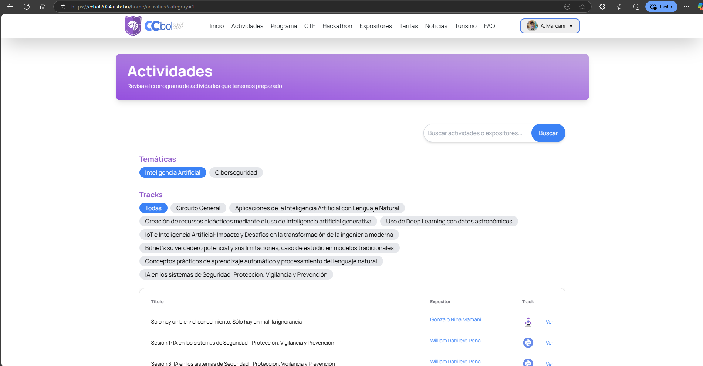
  </a>
  <a href="screenshots/screenshots03.png" target="_blank">
    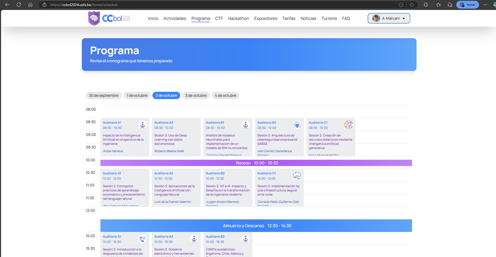
  </a>
  <a href="screenshots/screenshots04.png" target="_blank">
    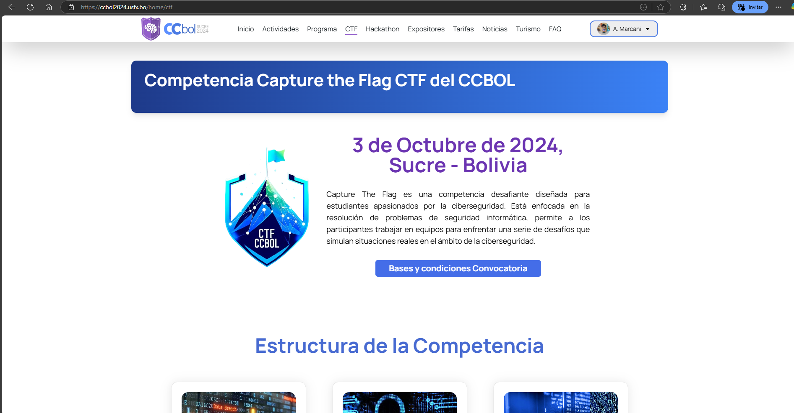
  </a>
  <a href="screenshots/screenshots05.png" target="_blank">
    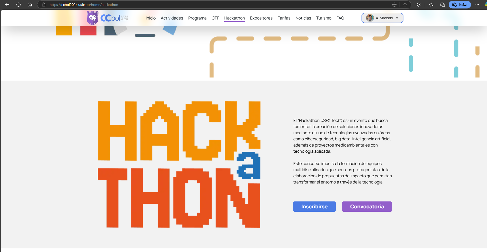
  </a>
  <a href="screenshots/screenshots06.png" target="_blank">
    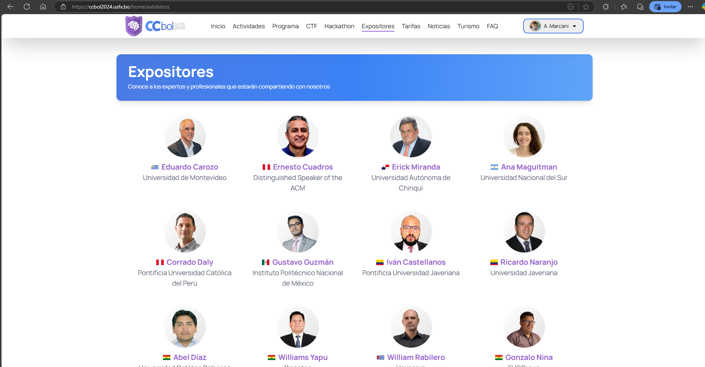
  </a>
  <a href="screenshots/screenshots07.png" target="_blank">
    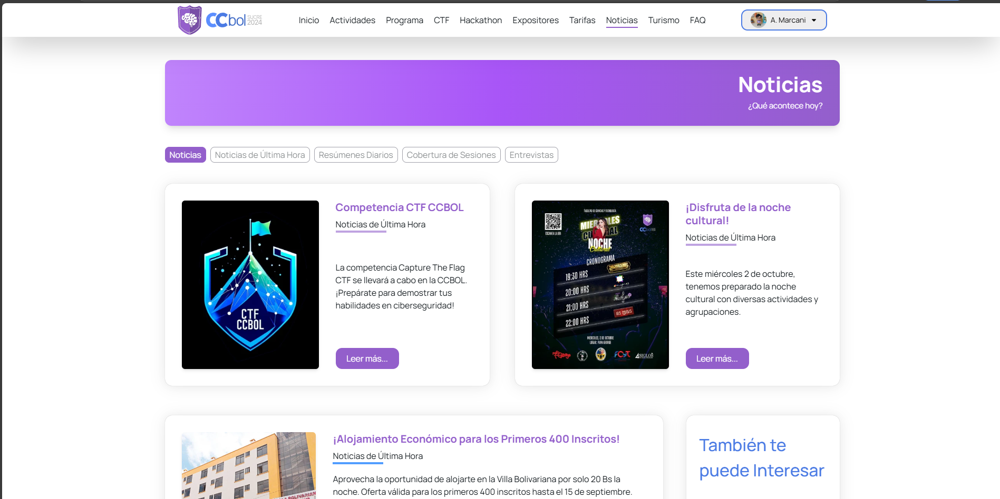
  </a>
  <a href="screenshots/screenshots08.png" target="_blank">
    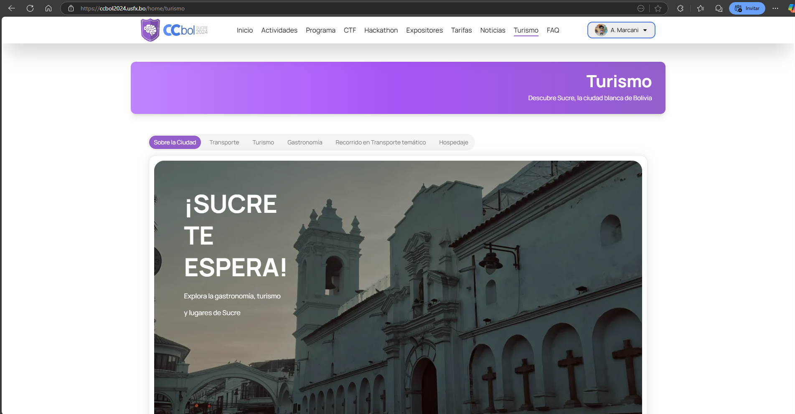
  </a>
  <a href="screenshots/screenshots09.png" target="_blank">
    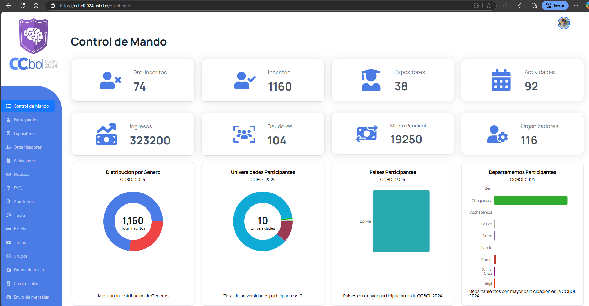
  </a>
  <a href="screenshots/screenshots10.png" target="_blank">
    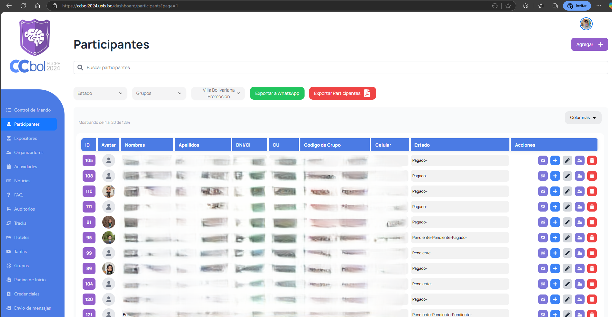
  </a>
  <a href="screenshots/screenshots11.png" target="_blank">
    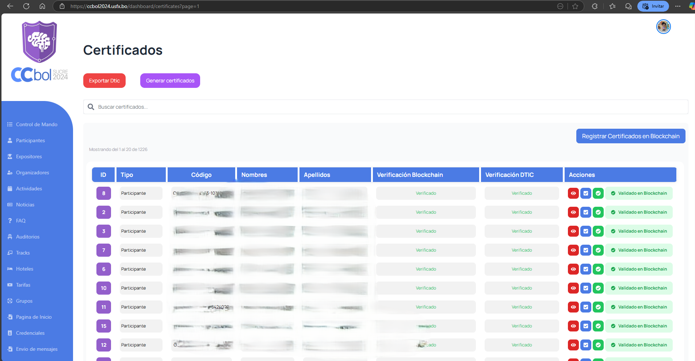
  </a>
  <a href="screenshots/screenshots12.png" target="_blank">
    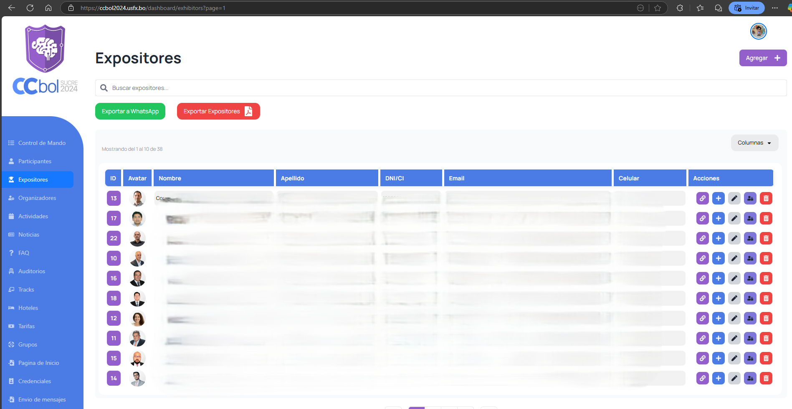
  </a>
  <a href="screenshots/screenshots13.png" target="_blank">
    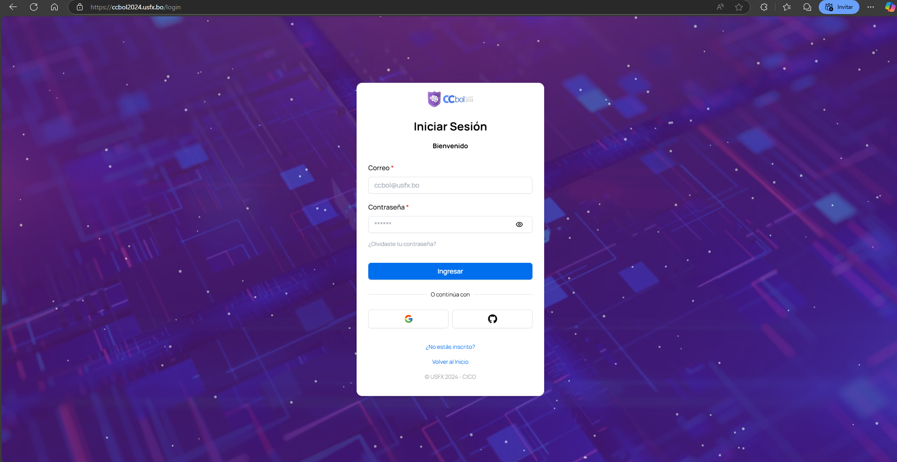
  </a>
  <a href="screenshots/screenshots14.png" target="_blank">
    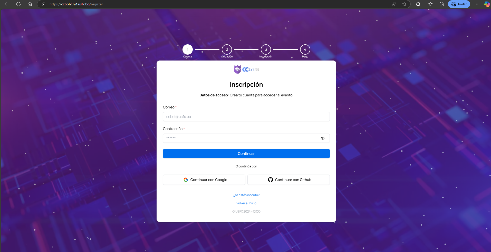
  </a>

---

> [!NOTE]
> **Nota Importante**
> 
> Por motivos de confidencialidad, no puedo compartir el código fuente de este proyecto. Sin embargo, estaré encantado de discutir más sobre mi participación, el proceso de desarrollo y el impacto del sistema.

---

✨ ¡Gracias por leer!
